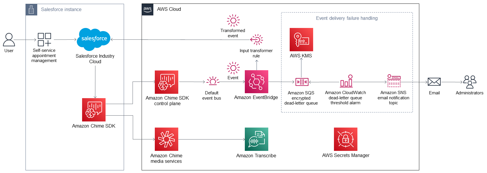

## Salesforce Industries Virtual Calls - Solution Guidance

## Guidance Deployment Guide

This Guidance was created by Salesforce, Inc. in collaboration with Amazon Web Services (AWS). A guidance is an automated reference deployment that help people deploy popular technologies on AWS according to AWS best practices. 

## Overview

This Guidance deploys Salesforce Industries: Virtual Calls on the AWS Cloud. This deployment integrates Virtual Calls with Amazon Chime to offer video conferencing for consumers using an industry cloud platform connected to Salesforce, Inc. Industry Cloud. Virtual Calls sessions provide both video and audio support for business-to-consumer (B2C) interactions. Video calls can use Amazon Transcribe to generate real-time audio transcriptions, which are then used to display text captions directly on the interface for accessibility.

## Support

This Guidance integrates various AWS services with Industry Cloud(s). To receive support from AWS, you must enroll in either AWS Business Support or a higher support plan. For details and costs, refer to [Compare AWS Support Plans](https://aws.amazon.com/premiumsupport/plans/).

## Architecture

Deploying this Guidance with default parameters builds the following Virtual Calls environment in the AWS Cloud.

**Architecture for Virtual Calls on AWS**

As shown in [Architecture for Virtual Calls on AWS](#architecture1), this Guidance sets up the following:

* Amazon Chime SDK control plane for receiving requests from Salesforce Industry Cloud when consumers request appointments through their industry cloud provider application.
* A default event bus for receiving event notifications from the control plane and delivering them to Amazon EventBridge.
* An EventBridge rule that filters aws.chime events and a predefined [input transformer rule](https://docs.aws.amazon.com/eventbridge/latest/userguide/eb-transform-target-input.html) that modifies the event and creates a [Salesforce platform event](https://developer.salesforce.com/docs/atlas.en-us.platform_events.meta/platform_events/platform_events_intro.htm).
* During an active session via a Salesforce-connected app, Amazon Chime SDK to communicate to the Amazon Chime media services endpoint to receive transcription requests.
* Amazon Transcribe for receiving and processing transcription requests.
* For event delivery failure handling:
    * An Amazon Simple Queue Service (Amazon SQS) queue that serves as a [dead-letter queue](https://docs.aws.amazon.com/eventbridge/latest/userguide/eb-rule-dlq.html).
    * AWS Key Management Service (AWS KMS) to encrypt all messages stored in the Amazon SQS queue.
    * An Amazon CloudWatch alarm that monitors the Amazon SQS queue depth and alerts when the configured threshold is exceeded.
    * An Amazon Simple Notification Service (Amazon SNS) topic to send email notifications to interested parties when the CloudWatch alarm is triggered.
* An AWS Secrets Manager secret for securely storing Salesforce credentials and connection secrets. Please note AWS Secrets Manager should be configured to automatically rotate the secret for enhanced security. 

## Deployment options

This Guidance provides the following deployment option for provisioning Virtual Calls resources into your new AWS account. Configure Virtual Calls settings as needed.

[Deploy Virtual Calls into a new AWS account](https://fwd.aws/P7jzX?)

## Upgrade an existing deployment of Virtual Calls

If you’ve already deployed Virtual Calls and just need to upgrade your existing deployment, perform the following steps:

1. Do the following steps to download the latest template file from GitHub:
    1. Navigate to the [Partner Solution landing page](https://fwd.aws/VVvWr?).
    2. Choose **View the source code for this Partner Solution** to open the GitHub repository.
    3. Open the **template** folder to access the latest CloudFormation template.
    4. Download the template.
2. In the AWS Management Console, choose **Services > CloudFormation**.
3. Choose the existing Virtual Care stack.
4. Choose **Update** to open the **Update stack** page.
5. Choose **Replace current template**, and upload the template file. Choose **Next**.
6. On the **Specify stack details** page, review the stack settings and update the control Region (for example, us-east-1) and messaging Region (for example, us-east-1). Choose **Next**.
7. On the **Configure stack options** page, review the changes and choose **Next**.
8. On the **Review** page, review and confirm template settings. Under **Capabilities**, select all of the check boxes to acknowledge that the template creates AWS Identity and Access Management (IAM) resources that might require the ability to automatically expand macros.
9. Choose **Submit**. The stack takes about 5 minutes to update.
10. Monitor the stack’s status, and when the status is **UPDATE_COMPLETE**, the Salesforce Industries: Virtual Calls deployment is ready.

## Predeployment steps

1. Configure a new AWS account. You can configure either a new standalone AWS account or a new account within an existing AWS organization. For more information, refer to:
    * [How do I create and activate a new AWS account?](https://aws.amazon.com/premiumsupport/knowledge-center/create-and-activate-aws-account/)
    * [Creating an AWS account that is part of your organization](https://docs.aws.amazon.com/organizations/latest/userguide/orgs_manage_accounts_create.html#orgs_manage_accounts_create-new)

1. Configure a Salesforce-connected app to integrate the events generated in AWS that are sent via Amazon EventBridge to Salesforce platform events. For instructions, refer to [Connect Amazon to Salesforce](https://help.salesforce.com/s/articleView?id=sf.video_call_connect_amazon_to_salesforce.htm&type=5).

## Deployment steps

1. Sign in to your AWS account, and launch this Guidance, as described under Deployment options. The AWS CloudFormation console opens with a prepopulated template.

2. Choose the correct AWS Region, and then choose Next.

3. On the Create stack page, keep the default setting for the template URL, and then choose Next.

4. On the Specify stack details page, change the stack name if needed. Review the parameters for the template. Provide values for the parameters that require input. For all other parameters, review the default settings and customize them as necessary. When you finish reviewing and customizing the parameters, choose Next.
5. On the Configure stack options page, you can specify tags (key-value pairs) for resources in your stack and set advanced options. When you finish, choose Next. 
6. On the Review page, review and confirm the template settings. Under Capabilities, select all of the check boxes to acknowledge that the template creates AWS Identity and Access Management (IAM) resources that might require the ability to automatically expand macros. 
7. Choose Create stack. The stack takes about 5 minutes to deploy. 
8. Monitor the stack’s status, and when the status is CREATE_COMPLETE, the Salesforce Industries: Virtual Calls deployment is ready. 
9. To view the created resources, choose the Outputs tab.

## Postdeployment steps

Configure a [Salesforce Named Credential](https://help.salesforce.com/s/articleView?id=sf.video_call_create_a_named_credential.htm&type=5) so that Virtual Calls can invoke AWS services.

To use AWS Identity and Access Management (IAM) to retrieve the user’s access key and secret that’s generated by this Guidance, do the following steps:

1. Log in to your AWS account. This account must have sufficient privileges to create an access key for the service account. For more information, refer to [CreateAccessKey](https://docs.aws.amazon.com/IAM/latest/APIReference/API_CreateAccessKey.html).
2. In the AWS Management Console, choose **Services > Identity Access Management (IAM)**.
3. Choose **Users**.
4. Choose the user specified in the AWS CloudFormation template definition.
5. Choose the **Security Credentials** tab.
6. Under the **Access Key** section, choose **Create access key**. This action creates an access key and allows you to copy or download the contents.

The access key ID and secret access key is used to configure a Salesforce Named Credential.

## Troubleshooting

For troubleshooting common install issues, refer to this guide [Troubleshooting CloudFormation](https://docs.aws.amazon.com/AWSCloudFormation/latest/UserGuide/troubleshooting.html).

## Costs and licenses

You will pay for the AWS services used while running this guidance. The Amazon Chime SDK and the Amazon Transcribe service offers pay-for-use pricing with no upfront fees.

As of September 2024, the cost for running this Guidance with the default settings in the US East (N. Virginia) is approximately $5.18 per month, for 1000 virtual call minutes-per-attendee and 100 total session-minutes. 

| Region                | Description                        | Service            | Monthly | Assumptions                                                                                                                                                                                                                                                                                                                                                                      |
|-----------------------|------------------------------------|--------------------|---------|----------------------------------------------------------------------------------------------------------------------------------------------------------------------------------------------------------------------------------------------------------------------------------------------------------------------------------------------------------------------------------|
| US East (N. Virginia) | Connect to a standard WebRTC session                | Amazon ChimeSDK    | $1.70  | Standard definition session at 1,000 minutes-per-attendee |
| US East (N. Virginia) | Capture of 720p composited WebRTC media             | Amazon ChimeSDK    | $1.00  | 100 session-minutes |
| US East (N. Virginia) | Messaging - Message Send+Control+System Message     | Amazon ChimeSDK    | $0.08  | 100 messages (Virtual Care waiting room) |
| US East (N. Virginia) | Standard Live Transcription                         | Amazon Transcribe  | $2.40  | 100 session-minutes standard live transcriptions|

## Customer responsibility

After you deploy this Guidance, confirm that your resources and services are updated and configured—including any required patches—to meet your security and other needs. For more information, refer to the Shared Responsibility Model.

## Cleanup

To remove the Guidance, you can delete the entire CloudFormation stack.

1. In the AWS Management Console, choose **Services > CloudFormation**.
2. Choose the existing Virtual Care stack.
3. Choose **Delete** to remove. 

